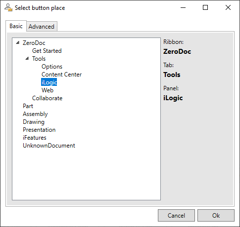

# Button Constructor (addin for Autodesk Inventor)
## introduction
	
> "iLogic enables rules-driven design, providing a simple way to capture and reuse your work. Use iLogic to standardize and automate design processes and configure your virtual products."
[Autodesk knowledge](https://knowledge.autodesk.com/support/inventor/learn-explore/caas/CloudHelp/cloudhelp/2020/ENU/Inventor-iLogic/files/GUID-9372F2A9-377E-40AB-92AA-5FC371BACF8C-htm.html)

That being said there is 1 issue that i always found troubeling. Starting a iLogic rule is not as easy as i would like. To much mouse clicks for me. It's possible to create buttons with VBA. There is a problem with that. On the internet there are many sources of great scripts. Propbaly many people can copy those script, but will have a dificult time creating a button with VBA. For me as cad manager it's more convenient to have a xml-file with all button data. Updating an xml-file from remote is easier than a VBA file. So VBA is not the way to go if you ask me...
There for I made this addon to help people to creating buttons. 
# What does it do.
The addon will let you create buttons for iLogic rules without writing any code. And it let you save all data in a XML-file.

# Setup
copy the following files:
 - Hjalte.iLogicButtons.addin
 - Hjalte.iLogicButtons.dll
 - RuleButtonSettings.Xml

To the directory:
 - %APPDATA%\Autodesk\Inventor {Year/Version} \Addins\
(e.g. C:\Users\\.....\AppData\Roaming\Autodesk\Inventor {Year/Version}\Addins)

# General Usage Instructions

This tool distingues 2 items. The "Button definition" and the "Place definition". With the following properties 
| Button definition | Place definition |
|------------|-----------|
|Small icon path| Ribbon name|
|Big icon path|Tab name| 
|List of "Place definitions"|Panel name| 
|(Description/Tooltip *) | (Internal tab name *)|
|(Internal button name *)|(Internal panel name *)|


_(* See advanced instructions for more information)_

These properties can be set in the Settings form. That form can found on 
_"(Ribbon)ZeroDoc" --> "(Tab)Tools" --> "(panel)iLogic"_


Create a button:
 - Start with slecting a external iLogic rule by clicking on "Add button". 
 - In the following dialog select the external iLogic rule that you want to make a button for. 
 - Select a icons  
   - Small icons need to be 16x16 pixels
   - Big icons need to be 32x32 pixels
   - if you dont select an icon the default icon will be used
 - Add a "Place definition" by clicking "Add place"

 

 - Select the place where you want to have the button.
 - click "Ok".
 - Repeat the steps above for all buttons and places you want to configure.

 - To delete (or add) button/place definition. Select it and right click it. In the menu select "Delete"


**All changes will take effect afther you restarted Inventor.**

 # Advance Usage Instructions

 When usig the basic settings its only possible to select exsisting places. 
 In the "Advanced" tab, of the "Place definition form", its also posible create your own "Ribbon Tabs" and "Ribbon pannels". 
 To do so you need fill the TextBoxes. The internal names need to me unique in inventor.


All settings are saved in the file "RuleButtonSettings.Xml". (You can find the file in your addon directory. Usually that is the directory: "%APPDATA%\Autodesk\Inventor {Year/version here}\Addins\")  It's possible to edit that file manualy. That has 2 advantages.
 - It's possible to add Description/Tooltip to a button.
 - It's possible to create internal names for buttons.  
   - This is necessary if you have 2 buttons with the same (internal) name

 (At the time of this writing its not jet possible to set this using the forms.)

Here you see the "ExternalRuleButton" node with all possible sub nodes for a button: 
```text
<ExternalRuleButton>
  <name>...</name>
  <internalName>...</internalName>
  <standardIconFilePath>...</standardIconFilePath>
  <largeIconFilePath>...</largeIconFilePath>
  <descriptionText>...</descriptionText>
  <places>
    <!-- Add ButtonPlace nodes here -->
  </places>
</ExternalRuleButton>
```
When editing the xml file keep the following in mind:
 - The "settingsButton" node may have the same sub nodes!
 - xml nodes are case sensitive.
 - you may need to escape special characters.

For cad managers: It's possible to copy this file to other computers for easy distribution of the button settings to other users.

# Privacy Policy

This addon does not collect any data from the user.

All information processed by the application remains on the local device and is not accessible by any 3rd party.

# Todo list
 - Add description textbox to settings form. 
 - Create support for VBa rules.
 - Option to set standard or small size.

 # Donate
 This addon is a completely free. However if you find it useful and it saves you time I would appreciate [a donation](https://www.paypal.com/cgi-bin/webscr?cmd=_donations&business=K8TUGQGWS22H4&item_name=My+addons+are+completely+free.+However+if+you+find+it+useful+and+it+saves+you+time+I+would+appreciate+a+donation.&currency_code=EUR).